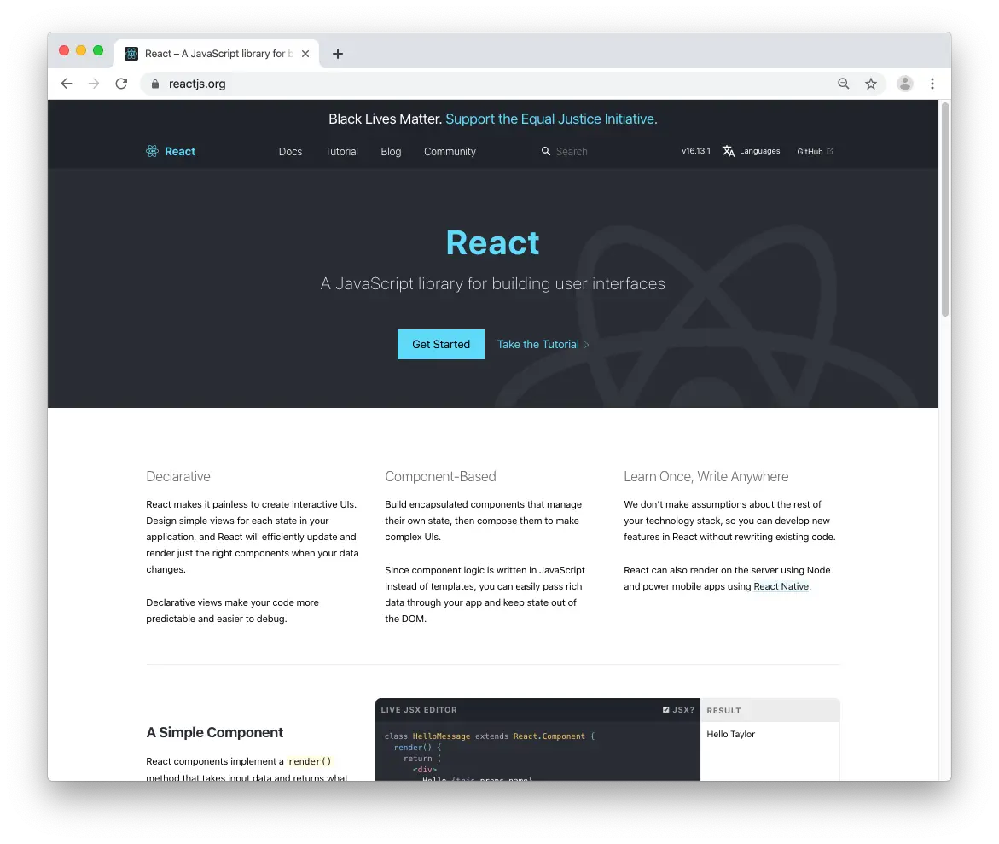
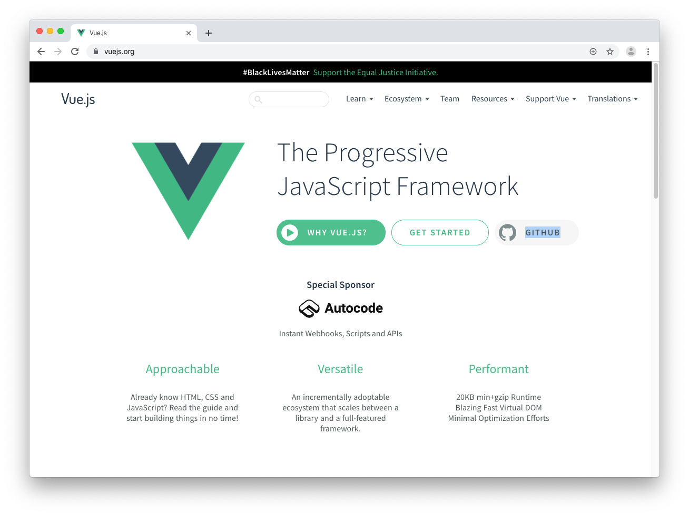
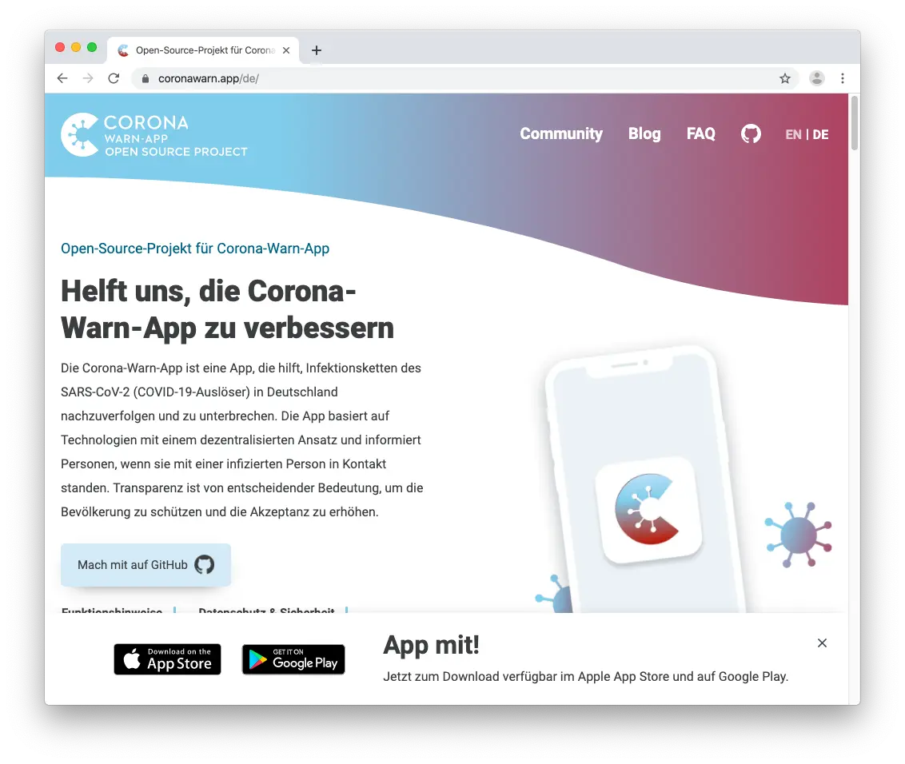

---

 

## React - website

Click on **[Ship to IONOS](https://buildwith.ionos.com/setup?repo=https://github.com/reactjs/reactjs.org)** to build & deploy this website build with [gatsby](https://www.gatsbyjs.com/) from [GitHub](https://github.com/reactjs/reactjs.org) yourself

---

 

## Vue.js - website

Click on **[Ship to IONOS](https://buildwith.ionos.com/setup?repo=https://github.com/vuejs/vuejs.org)** to build & deploy this website from [GitHub](https://github.com/vuejs/vuejs.org) yourself

---

 

## Corona Warn-App - website

Click on **[Ship to IONOS](https://buildwith.ionos.com/setup?repo=https://github.com/corona-warn-app/cwa-website)** to build & deploy this website from [GitHub](https://github.com/corona-warn-app/cwa-website) yourself

---

 